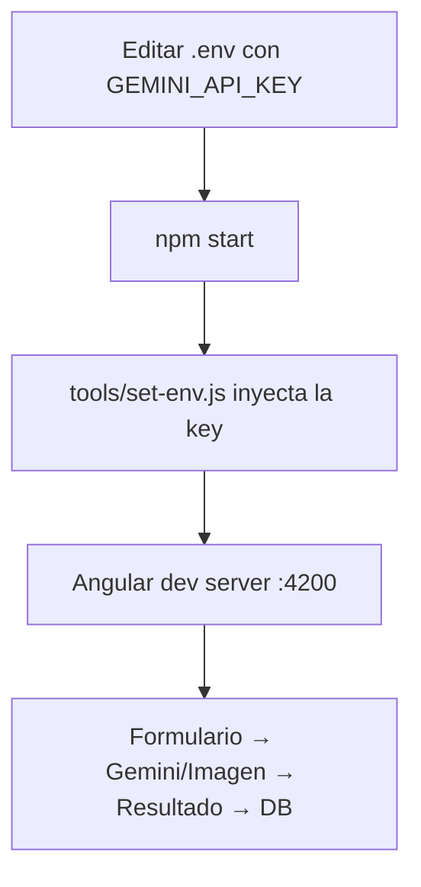

# AniDress - Generador de Outfits Anime & Pokémon

Aplicación web para generar outfits de estilo anime y Pokémon usando IA (Gemini/Imagen) o imágenes de banco (Unsplash/Picsum).

---

## Stack

| Tecnología | Versión |
|------------|---------|
| Angular (standalone, signals) | 18 |
| SCSS + Angular Material | 18 |
| Dexie.js (IndexedDB) | 4.x |
| @google/genai (Gemini + Imagen) | 1.7 |
| PokeAPI | REST |

---

## Prerequisitos

- Node.js 18+
- npm 9+
- Angular CLI 18 (`npm install -g @angular/cli`)
- (Opcional) API Key de [Unsplash](https://unsplash.com/developers) para banco de imágenes real

---

## Instalación

```bash
# 1. Clonar el repositorio
git clone <repo-url>
cd anidress

# 2. Instalar dependencias
npm install

# 3. Verificar que el archivo .env contiene la API key de Gemini
type .env
# Debe contener: export GEMINI_API_KEY = tu-api-key-aqui

# 4. (Opcional) Agregar Unsplash Access Key al .env
# export UNSPLASH_ACCESS_KEY = tu-unsplash-key
```

---

## Comandos

| Comando | Descripción |
|---------|-------------|
| `npm start` | Inicia servidor de desarrollo en `http://localhost:4200` |
| `npm run build` | Compila para producción en `dist/anidress-app` |
| `npm run lint` | Ejecuta ESLint sobre todos los archivos `.ts` y `.html` |
| `npm test` | Ejecuta pruebas unitarias (Karma) |

> **Nota**: `npm start` y `npm run build` ejecutan automáticamente `tools/set-env.js`, que inyecta `GEMINI_API_KEY` desde `.env` al `index.html` para que esté disponible en runtime.

---

## Estructura del proyecto

```
src/
├── app/
│   ├── core/
│   │   ├── models/
│   │   │   └── outfit.interface.ts      # Interfaces: OutfitRequest, OutfitResult, GarmentPiece, etc.
│   │   └── services/
│   │       ├── db.service.ts             # Dexie/IndexedDB - guarda y recupera outfits
│   │       ├── gemini.service.ts         # Llama a Imagen (imágenes) y Gemini (texto)
│   │       ├── unsplash.service.ts       # Busca imágenes en Unsplash o genera placeholders
│   │       └── pokeapi.service.ts        # Obtiene lista de Pokémon para sugerencias
│   ├── features/
│   │   ├── outfit-form/
│   │   │   ├── outfit-form.component.ts  # Formulario principal
│   │   │   ├── outfit-form.component.html
│   │   │   └── outfit-form.component.scss
│   │   └── outfit-result/
│   │       ├── outfit-result.component.ts # Resultado del outfit generado
│   │       ├── outfit-result.component.html
│   │       └── outfit-result.component.scss
│   ├── shared/ui/
│   │   └── suggestion-chips/
│   │       └── suggestion-chips.component.ts # Badges de Pokémon clickeables
│   ├── app.config.ts                     # Providers globales
│   ├── app.routes.ts                     # Lazy loading: / y /result/:id
│   └── app.component.ts                  # Shell raíz
├── tools/
│   └── set-env.js                        # Inyecta .env al index.html
├── styles.scss                           # Tema Angular Material + estilos globales
└── index.html                            # Entry point, fonts, window.env
```

---

## Funcionalidades

### 1. Formulario de entrada
- **Textarea**: descripción libre del outfit deseado
- **Género**: Masculino (M), Femenino (F), No binario (X)
- **Categoría**: Peinado, Outfit completo, Accesorios
- **Sugerencias Pokémon**: badges clickeables desde PokeAPI que autorellenan la descripción
- **Fuente de imagen**: alternar entre IA (Gemini/Imagen) o Banco de imágenes (Unsplash/Picsum)

### 2. Generación
- **IA (Gemini/Imagen)**: `ai.models.generateImages()` con modelo Imagen 3 para la imagen + `ai.models.generateContent()` con Gemini 2.0 Flash para la descripción textual de las piezas
- **Banco de imágenes**: búsqueda en Unsplash API (o placeholders de Picsum si no hay API key)
- Las piezas del outfit se parsean del texto generado (formato `- Prenda: descripción`)

### 3. Resultado
- Imagen principal (generada o buscada)
- Metadatos: prompt, género, categoría, fuente, fecha
- Lista de piezas del outfit con tarjetas descriptivas
- Botones: guardar/favorito, nuevo outfit
- Persistencia en IndexedDB vía Dexie.js

### 4. Base de datos (IndexedDB / Dexie.js)
- Tabla `outfits` con campos: `id`, `prompt`, `gender`, `category`, `imageSource`, `imageData`, `garments[]`, `createdAt`, `isFavorite`
- Operaciones CRUD: guardar, toggle favorito, eliminar, consulta por ID
- Signal `savedOutfits` reactiva para la UI

---

## Diseño visual

- **Paleta**: violeta profundo (`#4c1d95`) → rosa (`#831843`) → índigo oscuro (`#1e1b4b`)
- **Acentos**: dorado (`#fbbf24`) y rosa vibrante (`#f472b6`)
- **Tipografía**: Space Grotesk (títulos), Inter (cuerpo)
- **Efectos**: glassmorphism, gradientes animados, glow en hover, bordes redondeados (24px)
- **Tema**: Angular Material dark personalizado

---

## Flujo de trabajo del desarrollo



---

## Mejoras futuras

- [ ] Galería de outfits guardados con filtros
- [ ] Edición iterativa de imágenes (multi-turno)
- [ ] Exportar outfit como imagen PNG
- [ ] Compartir en redes sociales
- [ ] Más fuentes de imágenes (Pexels, Pixabay)
